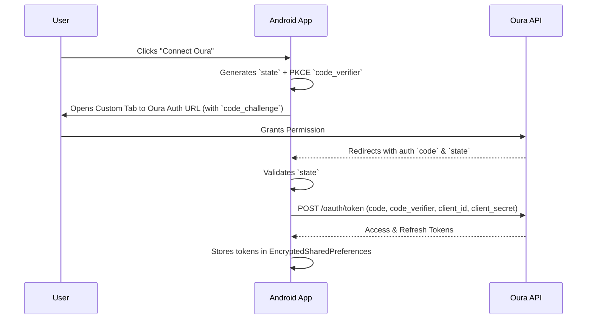

# Authentication

*(Note: Authentication flows are **planned** and not implemented in the current source).*

## Overview
The app requires Oura API access to fetch biometric data. Per [ADR-006](DECISIONS.md#adr-006-no-separate-backend-in-the-mvp)
the MVP has **no backend**: the OAuth2 authorization-code exchange happens **inside the app**.
The Oura client secret is injected into `BuildConfig` from a git-ignored `.env` file, and tokens
are stored in `EncryptedSharedPreferences`.

This is acceptable **only** because Treenivalmentaja is a private single-user APK that is never
published. See ADR-006 for the reasoning and the revisit triggers.

## OAuth2 Flow (Oura)
We use the standard OAuth2 Authorization Code flow with PKCE.

## Details

### Client Credentials
- `OURA_CLIENT_ID` and `OURA_CLIENT_SECRET` live in a local `.env` file at the repository root.
- `.env` is listed in `.gitignore` and **must never be committed**. `.env.example` documents the
  required keys with placeholder values only.
- The Secrets Gradle Plugin (already configured in `app/build.gradle.kts` with
  `propertiesFileName = ".env"`) injects them as `BuildConfig` fields at build time.
- No secret is ever written into Kotlin source, resources, or version control.

### PKCE
- A random `code_verifier` is generated per authorization attempt and stored transiently in memory
  (and in `SavedStateHandle` to survive process death during the Custom Tab round-trip).
- The `code_challenge` (S256) is sent with the authorization request; the `code_verifier` is sent
  with the token exchange. An intercepted authorization code is therefore not usable on its own.

### Redirect URI
- A custom scheme `treenivalmentaja://oauth2callback` is configured in the AndroidManifest and in
  the Oura Developer Console.
- The receiving activity validates the incoming Intent data before acting on it.

### State Validation
- A secure random `state` string is generated locally, passed to Oura, and compared on redirect.
  A mismatch aborts the flow with a security warning and no token exchange is attempted.

### Token Storage
- **Access Token:** `EncryptedSharedPreferences` (AES-256-GCM, key from the Android Keystore).
- **Refresh Token:** `EncryptedSharedPreferences`, same store.
- **Expiry:** the absolute expiry timestamp is stored alongside the tokens so refresh can be
  proactive rather than reactive.

### Token Renewal
- Handled locally. An OkHttp `Authenticator` intercepts `401 Unauthorized`, performs
  `grant_type=refresh_token` against the Oura token endpoint using the `BuildConfig` credentials,
  persists the rotated tokens, and retries the original request once.
- Concurrent refresh attempts are serialised so a rotated refresh token is not spent twice.

### Disconnect and Deletion Flow
- User clicks "Disconnect".
- App calls the Oura revoke endpoint with the current access token.
- App clears the `EncryptedSharedPreferences` entry and deletes cached Oura rows from Room
  (`OuraDailySummary`, `OuraWorkout`). Training plan data is untouched.
- Revocation failure does not block local deletion; the local tokens are dropped either way.

### Failure Cases
| Case | Behaviour |
| --- | --- |
| Network error during exchange | Error shown, tokens untouched, user can retry. |
| Invalid `state` | Abort flow, show security warning, do not exchange the code. |
| Missing `OURA_CLIENT_SECRET` in `.env` | Build succeeds (placeholder from `.env.example`), but the Settings screen shows "Oura-tunnuksia ei ole määritetty" and the connect button is disabled. |
| Token expiration | `Authenticator` refreshes transparently and retries once. |
| Refresh token rejected | Tokens cleared, user is prompted to reconnect. |

### What is explicitly NOT used
- Firebase Authentication (no anonymous auth, no Firebase UID).
- Firebase Functions (no proxy backend).
- Any remote token store.
