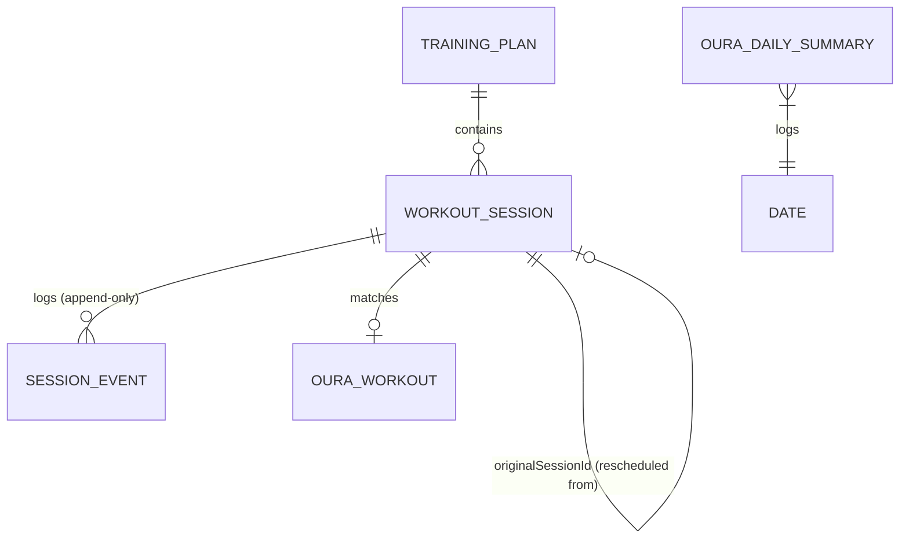

# Data Model

*(Status: **implemented**. `AppDatabase` is at schema version 1 with `exportSchema = false`; the
first schema change must add a schema export and a migration.)*

Room is the single source of truth ([ADR-003](DECISIONS.md#adr-003-local-offline-first-source-of-truth)).
The schema below is implemented in `fi.merilainen.treenivalmentaja.data.local`.

## Entity Relationship Diagram


## Core Entities

### 1. Training Plan (`TrainingPlan`)
- **Table:** `training_plans`
- **Purpose:** Represents an imported or generated training block.
- **Primary Key:** `id` (String — taken from the imported JSON, so re-importing the same plan is detectable)
- **Fields:**
  - `name` (String)
  - `schemaVersion` (Int) — the `schemaVersion` of the JSON it came from
  - `timeZone` (String — IANA id, e.g. `Europe/Helsinki`)
  - `startDate` (String — `YYYY-MM-DD`, local date in `timeZone`)
  - `createdAt` (Long — epoch millis UTC, when the plan was imported)
  - `contentHash` (String — SHA-256 of the normalised source JSON, used for duplicate detection)
  - `isActive` (Boolean)
- **Lifecycle:** Created on import. Deleting a plan cascades to its sessions and their events.

### 2. Workout Session (`WorkoutSession`)
- **Table:** `workout_sessions`
- **Purpose:** Represents a planned training session — the current state of it.
- **Primary Key:** `id` (String — unique across the whole plan, supplied by the JSON)
- **Relationships:**
  - Belongs to `TrainingPlan` via `planId` (foreign key, `ON DELETE CASCADE`, indexed).
  - `originalSessionId` (String?) — set when this row was created by rescheduling another
    session. It points at the `id` of the session that was closed with status `RESCHEDULED`.
    `null` for sessions that came straight from the import. Indexed.
- **Fields:**
  - `type` (Enum: `RUNNING`, `STRENGTH`, `SKIING`)
  - `weekNumber` (Int) — 1-based week within the plan
  - `scheduledDate` (String — `YYYY-MM-DD`, local date)
  - `scheduledTime` (String — `HH:mm`, local time)
  - `scheduledAtUtc` (Long — epoch millis, resolved from date+time+plan timezone; what AlarmManager uses)
  - `durationMin` (Int?)
  - `distanceKm` (Double?)
  - `intensity` (Enum?: `EASY`, `MODERATE`, `HARD`, `MAX`)
  - `rounds` (Int?) — circuit rounds, if the session is round-based
  - `exercisesJson` (String?) — the session's movements serialised as a JSON array (see below)
  - `lighterAlternativeJson` (String?) — the plan's explicit lighter variant, serialised
  - `description` (String?)
  - `status` (Enum — see [TRAINING_ENGINE.md](TRAINING_ENGINE.md#session-states):
    `PLANNED`, `NOTIFIED`, `STARTED`, `COMPLETED`, `SKIPPED`, `RESCHEDULED`,
    `REPLACED_WITH_LIGHTER_VERSION`, `PAUSED_DUE_TO_ILLNESS`, `CANCELLED`)
  - `appliedLighterVariant` (Boolean, default `false`) — stays `true` after the session later
    reaches `COMPLETED`, so "completed, but lighter" survives the transition
  - `updatedAt` (Long — epoch millis UTC)
- **Nullability:** `description`, `durationMin`, `distanceKm`, `intensity`, `rounds`, and both
  JSON blobs are nullable. A running session has `distanceKm` but usually no `exercisesJson`;
  a strength session is the other way round. Missing values are **never** coerced to `0`.
- **Lifecycle:** Inserted on import. Status is mutated by the engine and the user, but the date is
  never rewritten in place — rescheduling closes the row and inserts a new one.

#### Why lists are stored as JSON
`exercises` and `lighterAlternative` are nested, optional, and never queried by SQL — nothing
filters or sorts on "third set of the second exercise". Normalising them into two more tables
would add joins and migrations for no query benefit, so they are stored as serialised JSON via a
Room `TypeConverter` (Moshi). If a future feature needs to query individual movements, they get
promoted to their own table with a migration.

`exercisesJson` holds an array of:
```json
[{ "name": "Kyykky", "sets": 3, "reps": 10, "weightKg": 60.0, "restSec": 90, "notes": null }]
```

### 3. Session Event (`SessionEvent`) — immutable, append-only
- **Table:** `session_events`
- **Purpose:** The audit trail. Every accepted status transition appends exactly one row, in the
  same transaction as the session update. **Rows are never updated and never deleted** (the only
  exception is the cascade when the owning plan is deleted). The session table answers *what is
  true now*; this table answers *how it got there*.
- **Primary Key:** `id` (String — UUID generated at write time)
- **Relationships:** `sessionId` (foreign key to `workout_sessions.id`, `ON DELETE CASCADE`, indexed)
- **Fields:**
  - `timestampUtc` (Long — epoch millis UTC, when the event happened)
  - `fromStatus` (Enum?) — `null` only for the `CREATED` event
  - `toStatus` (Enum)
  - `source` (Enum: `USER`, `ENGINE`, `ALARM`, `OURA_SYNC`, `IMPORT`, `AI_ADVISOR`) — who caused it
  - `note` (String?) — short human-readable reason, e.g. `"Siirretty huomiselle"`
  - `payloadJson` (String?) — structured detail, e.g. the old and new date on a reschedule, or the
    id of the Oura workout that produced a match
- **Ordering:** queried as `ORDER BY timestampUtc ASC, id ASC` so events written within the same
  millisecond still have a stable order.
- **Lifecycle:** Insert-only. There is no `update` or `delete` method on `SessionEventDao`.

### 4. Oura Daily Summary (`OuraDailySummary`)
- **Table:** `oura_daily_summaries`
- **Purpose:** Caches daily readiness, sleep, and activity scores.
- **Primary Key:** `date` (String — `YYYY-MM-DD`)
- **Fields:**
  - `readinessScore` (Int?)
  - `sleepScore` (Int?)
  - `activityScore` (Int?)
  - `fetchedAtUtc` (Long)
- **Nullability:** All scores are nullable as Oura may not provide them (ring not worn). Missing
  data is **not** treated as zero — the UI shows "ei dataa".
- **Lifecycle:** Synced via WorkManager. Overwritten on update. Cleared when the user disconnects Oura.

### 5. Oura Workout (`OuraWorkout`)
- **Table:** `oura_workouts`
- **Purpose:** Represents a completed workout imported from Oura.
- **Primary Key:** `id` (String — Oura API ID)
- **Relationships:** Matches to `WorkoutSession` via `matchedSessionId` (String?, indexed).
- **Fields:**
  - `activityType` (String)
  - `startTimeUtc` (Long)
  - `endTimeUtc` (Long)
  - `calories` (Float?)
- **Lifecycle:** Synced via WorkManager. Immutable once fetched. Cleared on Oura disconnect.

## Rescheduling and the session chain
Moving a session never edits `scheduledDate` in place:

```
  s-w1-ti-juoksu  status=RESCHEDULED   originalSessionId=null
        ▲
        └── s-w1-ti-juoksu@2  status=PLANNED  originalSessionId="s-w1-ti-juoksu"
```

- Forward: `SELECT * FROM workout_sessions WHERE originalSessionId = :id`
- Backward: follow `originalSessionId` until it is `null` to reach the originally imported session.

A session may be moved repeatedly, producing a chain. Only the last link is non-terminal.

## Mapping
- **JSON to DB:** Import DTOs (Moshi) are validated, then mapped to Room entities in the
  repository layer. See [PLAN_SCHEMA.md](PLAN_SCHEMA.md).
- **API to DB:** Network models are mapped to Room entities in the repository layer.
- **DB to Domain:** Room entities are mapped to domain models before being exposed to the UI via
  `Flow`. UI code never sees an entity class.
