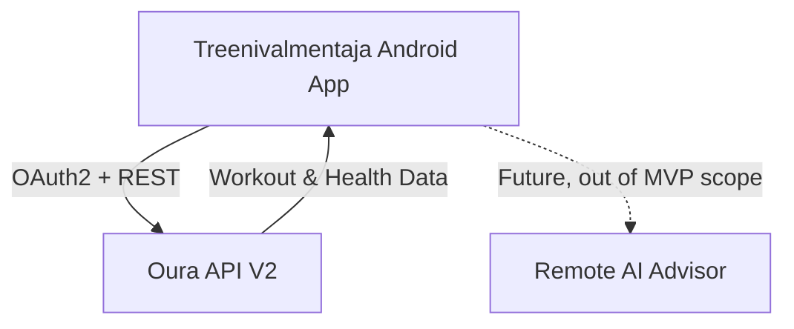
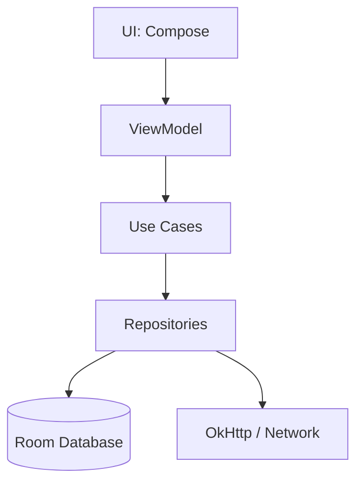

# Architecture

This document outlines the architecture for the Treenivalmentaja Android application. 
*(Note: the local half of this architecture — Compose UI, `WorkoutViewModel`, `TrainingEngine`,
`TrainingRepository`, Room and the AlarmManager reminders — is **implemented**. Of the Oura half,
the API client and the whole OAuth flow in `data/oura` exist, are tested, and are reachable from
Settings; the background sync and workout matching are **planned**, so nothing yet writes to the
Oura tables and no login has been completed against the live service. Network calls
do exist: the update check in `data/update`, a single `HttpURLConnection` GET of the published
build's metadata, and the exercise-guide lookups in `data/guide` against ExerciseDB and wger, also
plain `HttpURLConnection`, made when a movement is tapped and storing nothing —
[EXERCISE_GUIDE.md](EXERCISE_GUIDE.md).)*

## System Context
The application is a standalone Android app that acts as an offline-first training companion. It
retrieves health data from Oura, synchronizes it locally, and provides notifications.

Per [ADR-006](DECISIONS.md#adr-006-no-separate-backend-in-the-mvp) the MVP has **no backend of its
own**. The app talks to the Oura API V2 directly, including the OAuth2 token exchange. A future
AI advisor is the only remote service beyond Oura, and it is out of MVP scope.

## Android Modules
Currently, the app consists of a single `:app` module following Clean Architecture principles.
All source lives under the package `fi.merilainen.treenivalmentaja`.

- **UI Layer:** Jetpack Compose screens (`TodayScreen`, `WeekScreen`, `SettingsScreen`)
- **Presentation Layer:** `WorkoutViewModel`
- **Domain Layer:** models and status transition rules (`domain/`); use cases for scheduling and
  matching are still planned
- **Data Layer:** Room database, DAOs and repositories (`data/`); the Oura API client in
  `data/oura`, built on OkHttp ([ADR-007](DECISIONS.md#adr-007-okhttp-not-retrofit-for-the-oura-client))

## Backend Components
**None.** There is no server-side component in the MVP ([ADR-006](DECISIONS.md#adr-006-no-separate-backend-in-the-mvp)).
Specifically, the app does **not** use Firebase Functions, Firebase Authentication, or Firestore.

Everything that a backend would have done is done on-device:

| Concern | MVP implementation |
| --- | --- |
| OAuth2 code → token exchange | In-app POST to the Oura token endpoint, PKCE + client secret from `BuildConfig` |
| Client secret storage | Git-ignored `.env` → `BuildConfig` at build time |
| Token storage | `EncryptedSharedPreferences` |
| Token refresh | Local OkHttp `Authenticator` |
| Scheduling / rescheduling | Local deterministic engine over Room |

## Data Flows

### Data Flow from Oura to UI (Planned)
1. WorkManager triggers background sync.
2. App requests health data from Oura API (via Retrofit, using the locally stored access token).
3. Data is parsed and stored in Room.
4. ViewModel observes Room via Kotlin `Flow`.
5. Compose UI recomposes automatically with new data.

### Local Database Flow
Room acts as the single source of truth. All modifications (completing, skipping, shifting) are
written to Room first, which then emits updates to the UI.

Every status change writes **two** rows in one transaction: the updated `WorkoutSession` and a new
immutable `SessionEvent`. The session table holds current state; the event table holds the
append-only history. See [DATA_MODEL.md](DATA_MODEL.md) and [TRAINING_ENGINE.md](TRAINING_ENGINE.md).

### Notification Scheduling Flow
When the training plan in Room changes, a use case calculates upcoming alarms and updates
Android's `AlarmManager`. The alarms are **inexact** (`setAndAllowWhileIdle`), which keeps the app
clear of the exact-alarm permission, and only sessions belonging to the active plan are scheduled.

### Plan Import & Rescheduling Flow
- Plans are imported as JSON in the [Treenivalmentaja Training Plan Schema v1](PLAN_SCHEMA.md),
  either from a file (Storage Access Framework) or from the clipboard.
- The importer parses, then **validates before writing**: nothing reaches Room unless the whole
  document is valid. Errors are returned as a list of human-readable Finnish messages with a JSON
  path, and duplicate plans/sessions are detected up front.
- The deterministic engine can shift the schedule when sessions are missed, but **never on its
  own**. It used to run at every launch, which meant installing a build rewrote the calendar; it
  now needs an explicit trigger. See `WorkoutViewModel.checkMissedSessions`.
- Importing a plan **replaces** the previous one: the old plan and its sessions are deleted, not
  deactivated. See [DATA_MODEL.md](DATA_MODEL.md#replacing-a-plan).

### Workout Matching Flow
Oura workouts (potentially imported from Strava/Suunto) are synced and matched against the planned sessions in Room based on time, duration, and type.

### Future AI Proposal Flow
1. User requests AI advice.
2. App bundles recent health data and schedule into a prompt.
3. Remote AI service returns a JSON proposal.
4. App validates the JSON and presents it to the user.
5. User explicitly approves -> applied to Room.

## Offline Behaviour
The app is fully functional offline. The local deterministic engine reschedules workouts based on existing local data. Notifications rely on AlarmManager and do not require internet access.

## Error Handling
- Network errors during sync log silently and retry using WorkManager backoff policies.
- UI displays cached data during outages.
- Oura API rate limits will be respected using HTTP 429 backoff handling.

### Notification Scheduling Flow
`RescheduleAlarmsUseCase` computes the correct `remindAtUtc` for `PLANNED` sessions based on `ResolveReminderUseCase` and updates the database, ensuring AlarmManager fires at the exact desired times.
