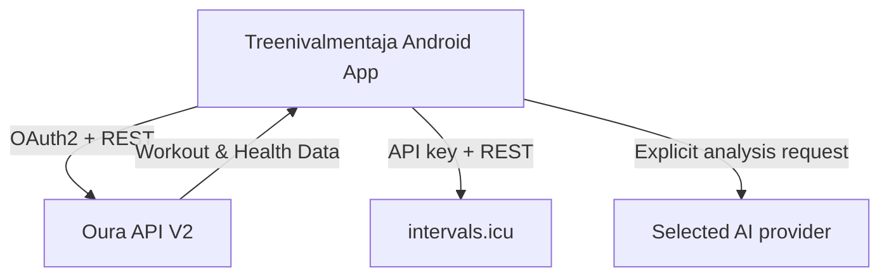
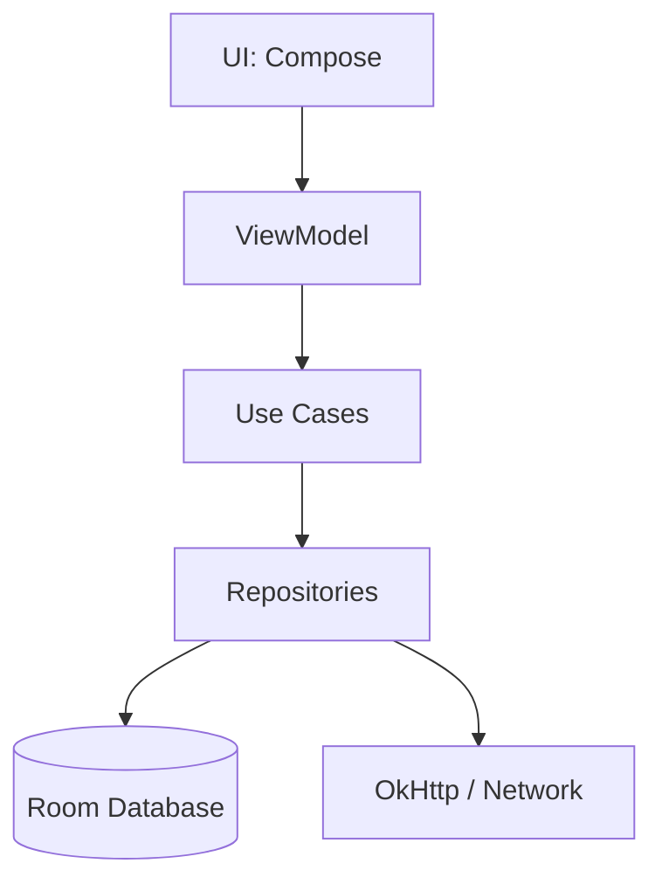

# Architecture

This document outlines the architecture for the Treenivalmentaja Android application. 
*(This architecture is implemented. Oura and intervals.icu sync and matching run on-device. The
optional AI feature is a direct, user-triggered, read-only workout analysis; AI-proposed plan
changes remain future work. Update checks and exercise-guide lookups are the other network flows.)*

## System Context
The application is a standalone Android app that acts as an offline-first training companion. It
retrieves health data from Oura, synchronizes it locally, and provides notifications.

Per [ADR-006](DECISIONS.md#adr-006-no-separate-backend-in-the-mvp) the MVP has **no backend of its
own**. The app talks directly to Oura, intervals.icu, the selected AI provider, ExerciseDB/wger and
the release metadata endpoint. AI providers are contacted only after an explicit analysis tap.

## Android Modules
Currently, the app consists of a single `:app` module following Clean Architecture principles.
All source lives under the package `fi.merilainen.treenivalmentaja`.

- **UI Layer:** Jetpack Compose screens (`TodayScreen`, `WeekScreen`, `SettingsScreen`)
- **Presentation Layer:** `WorkoutViewModel`
- **Domain Layer:** models and status transition rules (`domain/`), plus use cases —
  `RescheduleAlarmsUseCase`, `ResolveReminderUseCase`, `LoadExerciseGuideUseCase`,
  `CheckForUpdateUseCase` and `MatchOuraWorkoutsUseCase`
- **Data Layer:** Room database, DAOs and repositories (`data/`); the Oura API client in
  `data/oura`, built on OkHttp ([ADR-007](DECISIONS.md#adr-007-okhttp-not-retrofit-for-the-oura-client))

## Backend Components
**None.** There is no server-side component in the MVP ([ADR-006](DECISIONS.md#adr-006-no-separate-backend-in-the-mvp)).
Specifically, the app does **not** use Firebase Functions, Firebase Authentication, or Firestore.

Everything that a backend would have done is done on-device:

| Concern | MVP implementation |
| --- | --- |
| OAuth2 code → token exchange | In-app POST to the Oura token endpoint, PKCE (S256) + client secret |
| Client credentials | **Typed into Settings** and stored encrypted; `BuildConfig` from a git-ignored `.env` only as a fallback for local builds ([ADR-009](DECISIONS.md#adr-009-the-oura-client-credentials-are-entered-in-the-app-not-compiled-into-it)) |
| Token storage | AES-256-GCM under an Android Keystore key, in `SharedPreferences` — **not** `EncryptedSharedPreferences`, whose library is deprecated ([ADR-008](DECISIONS.md#adr-008-android-keystore-directly-rather-than-encryptedsharedpreferences)) |
| Token refresh | Local OkHttp `Authenticator`, serialised so a rotated refresh token is not spent twice |
| Scheduling / rescheduling | Local deterministic engine over Room |

## Data Flows

### Data flow from Oura to UI
1. A daily WorkManager job, or the Today or week screen **resuming**, triggers a sync.
2. `OuraClient` (OkHttp) requests the collections with the stored access token — and asks for one
   day beyond the range, because Oura's collections disagree about whether `end_date` includes its
   own day. See [API_INTEGRATIONS.md](API_INTEGRATIONS.md).
3. `OuraMappers` turns the documents into rows; `OuraRepository` writes them, then
   `MatchOuraWorkoutsUseCase` ties completed workouts to planned sessions.
4. The ViewModel observes Room via Kotlin `Flow`. **Never the network** — a failed sync leaves the
   last known reading on screen rather than an error.
5. Compose recomposes.

### Local Database Flow
Room acts as the single source of truth. All modifications (completing, skipping, shifting) are
written to Room first, which then emits updates to the UI.

Every status change writes **two** rows in one transaction: the updated `WorkoutSession` and a new
immutable `SessionEvent`. The session table holds current state; the event table holds the
append-only history. See [DATA_MODEL.md](DATA_MODEL.md) and [TRAINING_ENGINE.md](TRAINING_ENGINE.md).

### Notification Scheduling Flow
When the training plan in Room changes, a use case calculates upcoming alarms and updates
Android's `AlarmManager`. The alarms are **inexact** (`setAndAllowWhileIdle`), which keeps the app
clear of the exact-alarm permission, and only sessions belonging to the active plan are scheduled.

### Plan Import & Rescheduling Flow
- Plans are imported as JSON in the [Treenivalmentaja Training Plan Schema v1](PLAN_SCHEMA.md),
  either from a file (Storage Access Framework) or from the clipboard.
- The importer parses, then **validates before writing**: nothing reaches Room unless the whole
  document is valid. Errors are returned as a list of human-readable Finnish messages with a JSON
  path, and duplicate plans/sessions are detected up front.
- The deterministic engine can shift the schedule when sessions are missed, but **never on its
  own**. It used to run at every launch, which meant installing a build rewrote the calendar; it
  now computes a read-only proposal on Today and requires the user to accept its exact preview.
  Rejecting it writes nothing, and applying a stale proposal is refused.
- Importing a plan **replaces** the previous one: the old plan and its sessions are deleted, not
  deactivated. See [DATA_MODEL.md](DATA_MODEL.md#replacing-a-plan).

### Workout matching flow
Oura workouts are matched against planned sessions on **the same day, nearest in time, one-to-one,
and only when the activity fits** — see [TRAINING_ENGINE.md](TRAINING_ENGINE.md). Duration is
deliberately not compared: the plan's is what was asked for and Oura's is what happened, and the gap
between them is the interesting part rather than grounds for rejecting the pair. A match attaches
Oura's numbers to the session; it does not complete it.

"Today", sync windows, missed-session classification and Oura/intervals.icu timestamp-to-day
conversion all use the active plan's IANA timezone. The device timezone may change while travelling
without moving the plan to another calendar day. The ViewModel refreshes the date at plan-zone
midnight and again whenever a screen resumes, so a process can live across midnight safely.

Workouts **imported into Oura from Strava or Suunto do not arrive here at all** — measured, not
assumed. They reach only the daily activity and readiness scores. See
[API_INTEGRATIONS.md](API_INTEGRATIONS.md#third-party-imports--this-document-was-wrong).

### Future AI Proposal Flow
1. User requests AI advice.
2. App bundles recent health data and schedule into a prompt.
3. Remote AI service returns a JSON proposal.
4. App validates the JSON and presents it to the user.
5. User explicitly approves -> applied to Room.

### Theme selection flow
1. `ThemeSettingsStore` reads `theme_preference` from the `settings` DataStore — the same file the
   notification times, the AI model and the missed-session refusal live in — as a
   `Flow<ThemePreference>`.
2. `WorkoutViewModel` exposes it as `themePreference`, falling back to `ThemePreference.SYSTEM`
   until DataStore answers.
3. **`MainActivity` collects it**, not a screen: `MyApplicationTheme` wraps everything the app
   draws, splash included, so the preference has to be read above the navigation graph. This is
   why the ViewModel is built in `MainActivity` and passed into `TreenivalmentajaApp` rather than
   being created there.
4. `ThemePreference.SYSTEM` resolves through `isSystemInDarkTheme()` at composition time, so a
   phone that switches to dark at sunset takes the app with it without a restart. `LIGHT` and
   `DARK` ignore the system setting entirely.
5. Settings writes back through `WorkoutViewModel.setThemePreference`; the recolour follows the tap
   because step 3 is upstream of the card that produced it.

## Offline Behaviour
The app is fully functional offline. The local deterministic engine reschedules workouts based on existing local data. Notifications rely on AlarmManager and do not require internet access.

## Error Handling
- A failed sync returns rather than throws: it happens unasked, and a network that is merely
  absent must not crash a screen. The background worker retries with WorkManager's backoff when the
  failure is worth retrying, and gives up when it is not — a rejected token will be rejected
  identically forever.
- The UI displays what Room holds during outages.
- Every documented Oura status has its own type carrying an already-Finnish message and a `canRetry`
  flag, `429` included.

### Notification Scheduling Flow
`RescheduleAlarmsUseCase` computes the correct `remindAtUtc` for `PLANNED` sessions based on `ResolveReminderUseCase` and updates the database, ensuring AlarmManager fires at the exact desired times.
