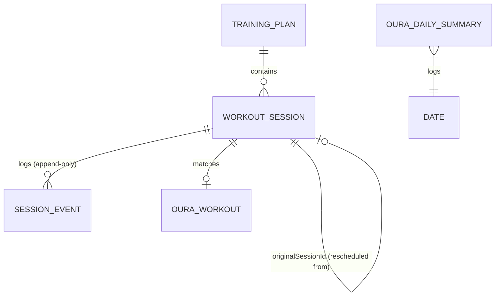

# Data Model

*(Status: **implemented**. `AppDatabase` is at schema version 12 with `exportSchema = true`;
schemas are written by KSP to `app/schemas/`. See "Schema versions and migrations" below.)*

Room is the single source of truth ([ADR-003](DECISIONS.md#adr-003-local-offline-first-source-of-truth)).
The schema below is implemented in `fi.merilainen.treenivalmentaja.data.local`.

## Entity Relationship Diagram


## Core Entities

### 1. Training Plan (`TrainingPlan`)
- **Table:** `training_plans`
- **Purpose:** Represents an imported or generated training block.
- **Primary Key:** `id` (String — taken from the imported JSON, so re-importing the same plan is detectable)
- **Fields:**
  - `name` (String)
  - `schemaVersion` (Int) — the `schemaVersion` of the JSON it came from
  - `timeZone` (String — IANA id, e.g. `Europe/Helsinki`)
  - `startDate` (String — `YYYY-MM-DD`, local date in `timeZone`)
  - `createdAt` (Long — epoch millis UTC, when the plan was imported)
  - `contentHash` (String — SHA-256 of the normalised source JSON, used for duplicate detection)
  - `isActive` (Boolean)
- **Lifecycle:** Created on import. Deleting a plan cascades to its sessions and their events.

### 2. Workout Session (`WorkoutSession`)
- **Table:** `workout_sessions`
- **Purpose:** Represents a planned training session — the current state of it.
- **Primary Key:** `id` (String — unique across the whole plan, supplied by the JSON)
- **Relationships:**
  - Belongs to `TrainingPlan` via `planId` (foreign key, `ON DELETE CASCADE`, indexed).
  - `originalSessionId` (String?) — set when this row was created by rescheduling another
    session. It points at the `id` of the session that was closed with status `RESCHEDULED`.
    `null` for sessions that came straight from the import. Indexed.
- **Fields:**
  - `type` (Enum: `RUNNING`, `STRENGTH`, `SKIING`)
  - `weekNumber` (Int) — 1-based week within the plan
  - `scheduledDate` (String — `YYYY-MM-DD`, local date)
  - `scheduledTime` (String — `HH:mm`, local time)
  - `remindAtUtc` (Long — epoch millis, resolved from date+time+plan timezone; what AlarmManager uses)
  - `durationMin` (Int?)
  - `distanceKm` (Double?)
  - `intensity` (Enum?: `EASY`, `MODERATE`, `HARD`, `MAX`)
  - `rounds` (Int?) — circuit rounds, if the session is round-based
  - `exercisesJson` (String?) — the session's movements serialised as a JSON array (see below)
  - `lighterAlternativeJson` (String?) — the plan's explicit lighter variant, serialised
  - `description` (String?)
  - `status` (Enum — see [TRAINING_ENGINE.md](TRAINING_ENGINE.md#session-states):
    `PLANNED`, `NOTIFIED`, `STARTED`, `COMPLETED`, `SKIPPED`, `RESCHEDULED`,
    `REPLACED_WITH_LIGHTER_VERSION`, `PAUSED_DUE_TO_ILLNESS`, `CANCELLED`)
  - `appliedLighterVariant` (Boolean, default `false`) — stays `true` after the session later
    reaches `COMPLETED`, so "completed, but lighter" survives the transition
  - `updatedAt` (Long — epoch millis UTC)
- **Nullability:** `description`, `durationMin`, `distanceKm`, `intensity`, `rounds`, and both
  JSON blobs are nullable. A running session has `distanceKm` but usually no `exercisesJson`;
  a strength session is the other way round. Missing values are **never** coerced to `0`.
- **Lifecycle:** Inserted on import. Status is mutated by the engine and the user, but the date is
  never rewritten in place — rescheduling closes the row and inserts a new one.

#### Why lists are stored as JSON
`exercises` and `lighterAlternative` are nested, optional, and never queried by SQL — nothing
filters or sorts on "third set of the second exercise". Normalising them into two more tables
would add joins and migrations for no query benefit, so they are stored as serialised JSON via a
Room `TypeConverter` (Moshi). If a future feature needs to query individual movements, they get
promoted to their own table with a migration.

`exercisesJson` holds an array of:
```json
[{ "name": "Kyykky", "sets": 3, "reps": 10, "weightKg": 60.0, "restSec": 90, "notes": null }]
```

An exercise whose sets differ from each other carries `setPlan` instead of `sets`/`reps`/
`weightKg` — see [PLAN_SCHEMA.md](PLAN_SCHEMA.md#setplan--sets-that-differ-from-each-other). An
exercise may also carry `guide`, the plan author's pointer into an exercise catalogue; nothing
fetched with it is ever stored, only the pointer itself
([EXERCISE_GUIDE.md](EXERCISE_GUIDE.md)). Because the whole array is one column, fields can be
added to it without a Room migration — which is why none of the plan's own growth has ever moved
the version.


#### Reminder Resolution (`remindAtUtc`)
`remindAtUtc` is a derived value, not a frozen snapshot from import. It dictates when the AlarmManager fires and controls the display order in the UI. It is recalculated automatically when:
- A plan is imported.
- Notification defaults are changed.
- A user overrides a specific session's time.

The order of priority is:
1. `reminderOverride` (user's manual adjustment for a session)
2. `scheduledTime` minus offset (if `timeIsFixed` is true)
3. Default notification setting for the `WorkoutType`
4. Fallback (18:00)

### 3. Session Event (`SessionEvent`) — immutable, append-only
- **Table:** `session_events`
- **Purpose:** The audit trail. Every accepted status transition appends exactly one row, in the
  same transaction as the session update. **Rows are never updated and never deleted** (the only
  exception is the cascade when the owning plan is deleted). The session table answers *what is
  true now*; this table answers *how it got there*.
- **Primary Key:** `id` (String — UUID generated at write time)
- **Relationships:** `sessionId` (foreign key to `workout_sessions.id`, `ON DELETE CASCADE`, indexed)
- **Fields:**
  - `timestampUtc` (Long — epoch millis UTC, when the event happened)
  - `fromStatus` (Enum?) — `null` only for the `CREATED` event
  - `toStatus` (Enum)
  - `source` (Enum: `USER`, `ENGINE`, `ALARM`, `OURA_SYNC`, `IMPORT`, `AI_ADVISOR`) — who caused it
  - `note` (String?) — short human-readable reason, e.g. `"Siirretty huomiselle"`
  - `payloadJson` (String?) — structured detail, e.g. the old and new date on a reschedule, or the
    id of the Oura workout that produced a match
- **Payload shapes:** one column serves several kinds of detail, so **every payload is written
  under a key that names it** rather than as a bare object (`SessionPayloadJson`). A reader asking
  for one shape on a row that carries another gets `null` because its key is absent, not because
  parsing happened to fail. Current keys:
  - `guided` — `{"done": Int, "rounds": Int, "perRound": Int}`, written on the `COMPLETED` event of
    a guided strength session: how many movements were ticked off, and the shape they were counted
    against. The shape travels with the count because "Kevyempi versio" can swap the movement list
    afterwards, and a count whose list has changed can still be reported honestly as a count while
    its movements can no longer be named. The AI analysis reads it back to tell a workout carried
    out in full from one abandoned half way; a session with no such payload has **nothing
    recorded**, which is not the same as nothing done and never renders as zero.
- **Ordering:** queried as `ORDER BY timestampUtc ASC, id ASC` so events written within the same
  millisecond still have a stable order.
- **Lifecycle:** Insert-only. There is no `update` or `delete` method on `SessionEventDao`.

### 4. Oura Daily Summary (`OuraDailySummary`)
- **Table:** `oura_daily_summaries`
- **Purpose:** Caches daily readiness, sleep and activity scores, **and the night's own
  measurements**.
- **Primary Key:** `date` (String — `YYYY-MM-DD`)
- **Fields:**
  - `readinessScore` (Int?)
  - `sleepScore` (Int?)
  - `activityScore` (Int?)
  - `averageHrvMs` (Int?) — average heart-rate variability during sleep, milliseconds
  - `restingHrBpm` (Int?) — Oura's `lowest_heart_rate`, the resting figure its own app shows
  - `sleepHrBpm` (Int?) — average heart rate across the night
  - `fetchedAtUtc` (Long)
- **Two collections, one row.** The three scores come from `daily_readiness`, `daily_sleep` and
  `daily_activity`; the three measurements come from the **sleep periods** collection (`sleep`),
  added at schema v11. They share a row because Oura keys a sleep period by the day it *belongs
  to* — the morning you wake up — which is already this table's primary key. No join, no offset.
- **One period per day, not an average.** The sleep collection returns several documents for a day
  when naps are recorded. The night is the `long_sleep` period, falling back to the longest
  remaining one; `rest` and `deleted` periods are discarded. Averaging them would blend a
  twenty-minute nap's HRV into the night's and quietly corrupt the trend. See `OuraMappers`.
- **Nullability:** All six are nullable as Oura may not provide them (ring not worn, night not
  scored, or the sleep-periods fetch failing on its own without failing the sync). Missing data is
  **not** treated as zero — the UI shows "ei dataa", and an HRV of 0 would read as autonomic
  collapse rather than as no reading.
- **Lifecycle:** Synced via WorkManager. Overwritten on update. Cleared when the user disconnects Oura.

### 5. Oura Workout (`OuraWorkout`)
- **Table:** `oura_workouts`
- **Purpose:** Represents a completed workout imported from Oura.
- **Primary Key:** `id` (String — Oura API ID)
- **Relationships:** Matches to `WorkoutSession` via `matchedSessionId` (String?, indexed). Filled by
  `MatchOuraWorkoutsUseCase` after a sync — same day, nearest in time, one-to-one — not by Oura.
- **Fields:**
  - `activityType` (String — Oura's own free-form word, e.g. `running`)
  - `startTimeUtc` (Long)
  - `endTimeUtc` (Long)
  - `calories` (Float?)
  - `distanceMeters` (Double?) — metres, as Oura reports them
  - `avgHeartRate` (Int?), `maxHeartRate` (Int?) — **not fields Oura returns on a workout.** Oura
    provides no heart rate there at all; these are reduced from the `heartrate` time series over the
    workout's own window, and stay `null` when the `heartrate` scope was not granted or nothing was
    recorded. Added in schema version 5 by an auto migration.
- **Lifecycle:** Synced via WorkManager. Immutable once fetched. Cleared on Oura disconnect.

### 6. Intervals.icu Activity (`IntervalsActivity`)
- **Table:** `intervals_activities`
- **Purpose:** Represents an activity read from intervals.icu, where the Suunto watch's recordings
  arrive — the running telemetry Oura does not carry. Added in schema version 7, replacing the
  `strava_activities` table of version 6.
- **Distance:** taken from `icu_distance` when present, otherwise `distance`. The specification
  describes neither and does not say how they differ, so this is a stated preference with a
  fallback rather than a documented fact.
- **Primary Key:** `id` (**String** — intervals.icu's own activity id, e.g. `i84461234`). A string
  rather than the number Strava used, and what makes the sync idempotent: a re-fetched activity
  overwrites itself instead of arriving twice. Nothing compares start times or distances to guess
  whether two records are the same activity.
- **Relationships:** Matches to `WorkoutSession` via `matchedSessionId` (String?, indexed), filled
  by the **same** `MatchOuraWorkoutsUseCase` the Oura workouts go through — same day, nearest in
  time, one-to-one, and the sport has to fit. A session can hold an Oura workout *and* a watch
  activity at once: two devices recorded the same run, and the screens show both lines rather than
  choosing between them.
- **Fields:**
  - `name` (String?) — the activity's title, e.g. "Aamulenkki"
  - `sportType` (String) — e.g. `Run`, `TrailRun`, `WeightTraining`. The API declares no enum for
    it, so the app does not treat it as one.
  - `startTimeUtc` (Long)
  - `movingTimeSec` (Long) — **pace is computed from this**, not from elapsed time
  - `elapsedTimeSec` (Long?)
  - `distanceMeters` (Double?)
  - `avgHeartRate` (Int?), `maxHeartRate` (Int?) — absent without a sensor
  - `elevationGainMeters` (Double?)
  - `recordingTimeSec` (Long?) — `icu_recording_time`, the total that matches the watch
  - `avgSpeedMps` (Double?) — the watch's own average speed. `distanceMeters / avgSpeedMps` gives
    back the watch's own duration, which is why the speed is stored and the duration is not
  - `maxSpeedMps` (Double?)
  - `avgCadence` (Int?) — **cycles** per minute as the service sent it, one leg. Doubled into steps
    at display, never here
  - `calories` (Int?) — present here, where Strava's summary endpoint carried none
  - `trainingLoad` (Int?) — intervals.icu's own `icu_training_load`
  - `intensity` (Double?) — `icu_intensity`, **stored exactly as the service sent it**. Its scale is
    undocumented, so normalising on the way in would bake a guess into the database where it could
    never be re-examined; the interpretation lives in `CompletedRunMetrics.intensityPercent`
  - `source` (String?) — a documented enum: `SUUNTO`, `UPLOAD`, `MANUAL`, `STRAVA`, … Stored
    because it answers "did this come off the watch", **never filtered on**: a run uploaded by hand
    is still that run
  - `hrLoad` (Int?), `trimp` (Double?) — intervals.icu's other two load figures
  - `atl` (Double?), `ctl` (Double?) — acute and chronic load, i.e. fatigue and fitness. Stored
    because a use is **named** (the fatigue rule in [ROADMAP.md](ROADMAP.md)), not in case one
    appears; nothing reads them yet
  - `deviceName` (String?) — kept for diagnostics, shown nowhere
  - `fetchedAtUtc` (Long)
- **Nullability:** The same rule as the Oura tables. A treadmill run has no distance, a run without
  a strap has no heart rate, a flat run reports zero climb, and none of those becomes a zero on
  screen.
- **Lifecycle:** Synced when Tänään or Viikko opens, over a window that overlaps the previous one
  because an activity can arrive late. Cleared when the API key is removed.

## Rescheduling and the session chain
Moving a session never edits `scheduledDate` in place:

```
  s-w1-ti-juoksu  status=RESCHEDULED   originalSessionId=null
        ▲
        └── s-w1-ti-juoksu@2  status=PLANNED  originalSessionId="s-w1-ti-juoksu"
```

- Forward: `SELECT * FROM workout_sessions WHERE originalSessionId = :id`
- Backward: follow `originalSessionId` until it is `null` to reach the originally imported session.

A session may be moved repeatedly, producing a chain. Only the last link is non-terminal.

## Replacing a plan

Importing a plan **deletes** the one it replaces, rather than deactivating it and leaving the rows
behind. Deleting the `training_plans` row is enough: `workout_sessions` cascades from it and
`session_events` cascades from those.

Completed sessions go with it. That is deliberate — the record of what was actually trained lives
in Oura, which already collects both tracked workouts and ones it detects on its own, and there is
no value in a second, thinner copy here. This app's job is the plan ahead.

Keeping the old rows was not free. They were invisible in every screen, since those all join on
`isActive = 1`, and they grew the database with every import — but they also still owned alarms,
so a replaced programme carried on sending its own reminders beside the current one.

Plans left behind by builds that only deactivated are cleared at startup by
`TrainingRepository.deleteReplacedPlans`. It is the one thing the app does to the database on
launch besides seeding an empty install, and it is safe there precisely because it can only remove
rows nothing reads.

## Schema versions and migrations

The version number describes the **shape** of the tables, never how much data they hold. Inserting
rows never changes it. It changes when a column, table or index appears, disappears or is renamed.

A consequence worth stating, because it is easy to assume otherwise: the Oura tables existed at
version 4 with no writer at all. Wiring up the Oura integration filled them without moving the
version, exactly as expected — the tables were already the right shape. Version 5 came later and for
a different reason: three new **columns** on `oura_workouts` (`distanceMeters`, `avgHeartRate`,
`maxHeartRate`), added by an auto migration. Version 6 added the whole `strava_activities` table,
likewise by an auto migration — a new table is as additive as a new nullable column.

Version 7 is the first that **removes** something: `strava_activities` goes and
`intervals_activities` arrives, because Strava paywalled its API and the watch data now comes
through intervals.icu. A drop is still an auto migration when it is *declared* — the `@DeleteTable`
spec on `AppDatabase.DropStravaActivities` is what tells Room the table is meant to go rather than
to be renamed with its rows carried across. Without it Room refuses to generate the migration at
all, which is the right default: a table present in one schema and absent from the next is
genuinely ambiguous. Nothing was lost by the drop — Strava was never connected to a real account,
so the table has always been empty on every device.

Version 8 is additive again: `avgCadence` and `intensity` on `intervals_activities`, by an auto
migration. An activity stored before them keeps its values and gets nulls — not a zero cadence,
which would read as a runner who never took a step.

Version 9 adds `recordingTimeSec`, `avgSpeedMps`, `maxSpeedMps`, `hrLoad` and `trimp`, likewise by
auto migration. `avgSpeedMps` is the one that matters: an activity synced before it cannot show the
watch's own duration until it is fetched again, and gets a null rather than a zero speed. Version 10
adds `atl` and `ctl`.

**Adding a column does not fill it**, and that is worth stating because three versions in a row now
have run into it. The ordinary sync looks back a fortnight, so an activity older than that keeps its
null forever unless something goes and asks again. The answer is `IntervalsRepository.backfill`,
which re-reads the whole history a year at a time — not storing raw JSON against the day a field is
wanted, because intervals.icu still has it and can simply be asked.

The API key and the OAuth tokens, incidentally, never touched the schema at all. They live in
encrypted `SharedPreferences` rather than in Room
([ADR-008](DECISIONS.md#adr-008-android-keystore-directly-rather-than-encryptedsharedpreferences)).

**There is no `fallbackToDestructiveMigration`, on purpose.** With it, a schema change lacking a
migration empties the database silently: no error, no log line, just a blank history on the next
launch. Without it Room throws on open and the app refuses to start, while the data sits untouched
on disk waiting for the migration to be written. The loud failure is the one you can act on.

Adding a version means, every time:

1. Change the entities and bump `version` on `@Database`.
2. **Additive change** (new table, new nullable column, new column with a default, new index):
   declare `autoMigrations = [AutoMigration(from = N, to = N+1)]`. Room generates the SQL by
   diffing the exported schema JSONs — no hand-written SQL, and nothing to get wrong.
3. **Rename or drop:** add `@RenameColumn` / `@DeleteColumn` specs, or hand-write a `Migration`.
   `MIGRATION_3_4` is the worked example: SQLite cannot rename a column in place, so it builds the
   new table, copies every column across, drops the old one and recreates the indices.
4. Add a case to `MigrationTest`. A migration nobody ran is not a migration — this is the step that
   catches the copy that silently dropped a column.

`app/schemas/` holds `3.json` through `12.json`; versions 1 and 2 predate the export and cannot be
migrated from. That matters only for an install still sitting on one of them.

Before installing a build that bumps the version, take a copy of the device database with
`tools/backup-db.ps1`.

## Mapping
- **JSON to DB:** Import DTOs (Moshi) are validated, then mapped to Room entities in the
  repository layer. See [PLAN_SCHEMA.md](PLAN_SCHEMA.md).
- **API to DB:** Network models are mapped to Room entities in the repository layer.
- **DB to Domain:** Room entities are mapped to domain models before being exposed to the UI via
  `Flow`. UI code never sees an entity class.

### 7. Intervals.icu daily training load (`IntervalsWellness`)
- **Table:** `intervals_wellness`
- **Purpose:** The athlete's fitness and fatigue **per day**, from intervals.icu's wellness record.
- **Primary Key:** `date` (String — `YYYY-MM-DD`)
- **Fields:**
  - `ctl` (Double?) — chronic training load: fitness, the long rolling average
  - `atl` (Double?) — acute training load: fatigue, the short rolling average
  - `rampRate` (Double?) — CTL change per week
  - `fetchedAtUtc` (Long)
- **Why this exists when `intervals_activities` already has `atl`/`ctl`.** Those columns are frozen
  at the moment of a session: they record the load *immediately after that activity* and never
  decay. Both figures fall every day that follows — ATL on roughly a 7-day time constant, CTL on 42.
  Reading them for "how loaded is the athlete now" is therefore wrong by however many days have
  passed. Measured on real data: a run on 16 August stored `atl` 17.7 / `ctl` 11.7, while the
  wellness record for 19 August said 11.5 / 10.9 — a TSB of −5.9 against a true −0.6, which is the
  difference between "ease off" and "go as planned".
- **The activity columns stay.** The load right after a session is a true and different fact; nothing
  reads it for the AI analysis any more. Removing it would lose data to fix a misuse.
- **What is deliberately not stored.** The wellness record also carries `hrv`, `restingHR`,
  `sleepScore` and `readiness`. Oura is already this app's source for those, and a second source for
  the same measurement is a question about which one wins that nobody wants to answer.
- **Nullability:** `ctl` and `atl` are nullable, and a record with neither is dropped at the mapper
  rather than stored — a row of nulls would later read as "the athlete has no fitness" instead of
  "not known".
- **Lifecycle:** Written by the ordinary intervals.icu sync, whose failure it cannot cause (it is
  caught separately). Cleared when the user removes the API key. Added at schema v12.
