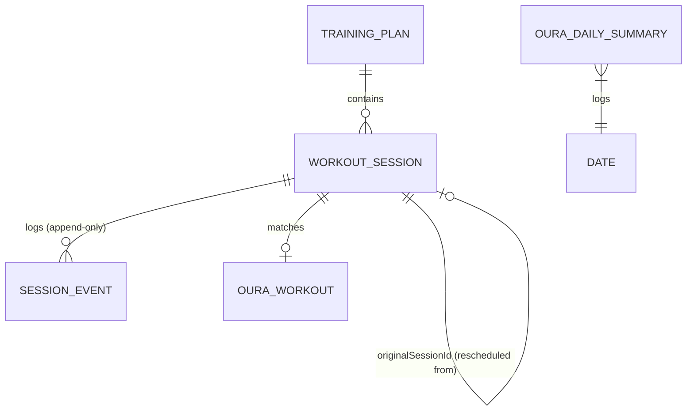

# Data Model

*(Status: **implemented**. `AppDatabase` is at schema version 4 with `exportSchema = true`;
schemas are written by KSP to `app/schemas/`. See "Schema versions and migrations" below.)*

Room is the single source of truth ([ADR-003](DECISIONS.md#adr-003-local-offline-first-source-of-truth)).
The schema below is implemented in `fi.merilainen.treenivalmentaja.data.local`.

## Entity Relationship Diagram


## Core Entities

### 1. Training Plan (`TrainingPlan`)
- **Table:** `training_plans`
- **Purpose:** Represents an imported or generated training block.
- **Primary Key:** `id` (String — taken from the imported JSON, so re-importing the same plan is detectable)
- **Fields:**
  - `name` (String)
  - `schemaVersion` (Int) — the `schemaVersion` of the JSON it came from
  - `timeZone` (String — IANA id, e.g. `Europe/Helsinki`)
  - `startDate` (String — `YYYY-MM-DD`, local date in `timeZone`)
  - `createdAt` (Long — epoch millis UTC, when the plan was imported)
  - `contentHash` (String — SHA-256 of the normalised source JSON, used for duplicate detection)
  - `isActive` (Boolean)
- **Lifecycle:** Created on import. Deleting a plan cascades to its sessions and their events.

### 2. Workout Session (`WorkoutSession`)
- **Table:** `workout_sessions`
- **Purpose:** Represents a planned training session — the current state of it.
- **Primary Key:** `id` (String — unique across the whole plan, supplied by the JSON)
- **Relationships:**
  - Belongs to `TrainingPlan` via `planId` (foreign key, `ON DELETE CASCADE`, indexed).
  - `originalSessionId` (String?) — set when this row was created by rescheduling another
    session. It points at the `id` of the session that was closed with status `RESCHEDULED`.
    `null` for sessions that came straight from the import. Indexed.
- **Fields:**
  - `type` (Enum: `RUNNING`, `STRENGTH`, `SKIING`)
  - `weekNumber` (Int) — 1-based week within the plan
  - `scheduledDate` (String — `YYYY-MM-DD`, local date)
  - `scheduledTime` (String — `HH:mm`, local time)
  - `remindAtUtc` (Long — epoch millis, resolved from date+time+plan timezone; what AlarmManager uses)
  - `durationMin` (Int?)
  - `distanceKm` (Double?)
  - `intensity` (Enum?: `EASY`, `MODERATE`, `HARD`, `MAX`)
  - `rounds` (Int?) — circuit rounds, if the session is round-based
  - `exercisesJson` (String?) — the session's movements serialised as a JSON array (see below)
  - `lighterAlternativeJson` (String?) — the plan's explicit lighter variant, serialised
  - `description` (String?)
  - `status` (Enum — see [TRAINING_ENGINE.md](TRAINING_ENGINE.md#session-states):
    `PLANNED`, `NOTIFIED`, `STARTED`, `COMPLETED`, `SKIPPED`, `RESCHEDULED`,
    `REPLACED_WITH_LIGHTER_VERSION`, `PAUSED_DUE_TO_ILLNESS`, `CANCELLED`)
  - `appliedLighterVariant` (Boolean, default `false`) — stays `true` after the session later
    reaches `COMPLETED`, so "completed, but lighter" survives the transition
  - `updatedAt` (Long — epoch millis UTC)
- **Nullability:** `description`, `durationMin`, `distanceKm`, `intensity`, `rounds`, and both
  JSON blobs are nullable. A running session has `distanceKm` but usually no `exercisesJson`;
  a strength session is the other way round. Missing values are **never** coerced to `0`.
- **Lifecycle:** Inserted on import. Status is mutated by the engine and the user, but the date is
  never rewritten in place — rescheduling closes the row and inserts a new one.

#### Why lists are stored as JSON
`exercises` and `lighterAlternative` are nested, optional, and never queried by SQL — nothing
filters or sorts on "third set of the second exercise". Normalising them into two more tables
would add joins and migrations for no query benefit, so they are stored as serialised JSON via a
Room `TypeConverter` (Moshi). If a future feature needs to query individual movements, they get
promoted to their own table with a migration.

`exercisesJson` holds an array of:
```json
[{ "name": "Kyykky", "sets": 3, "reps": 10, "weightKg": 60.0, "restSec": 90, "notes": null }]
```

An exercise whose sets differ from each other carries `setPlan` instead of `sets`/`reps`/
`weightKg` — see [PLAN_SCHEMA.md](PLAN_SCHEMA.md#setplan--sets-that-differ-from-each-other).
Because the whole array is one column, fields can be added to it without a Room migration, which
is why the schema is still at version 4.


#### Reminder Resolution (`remindAtUtc`)
`remindAtUtc` is a derived value, not a frozen snapshot from import. It dictates when the AlarmManager fires and controls the display order in the UI. It is recalculated automatically when:
- A plan is imported.
- Notification defaults are changed.
- A user overrides a specific session's time.

The order of priority is:
1. `reminderOverride` (user's manual adjustment for a session)
2. `scheduledTime` minus offset (if `timeIsFixed` is true)
3. Default notification setting for the `WorkoutType`
4. Fallback (18:00)

### 3. Session Event (`SessionEvent`) — immutable, append-only
- **Table:** `session_events`
- **Purpose:** The audit trail. Every accepted status transition appends exactly one row, in the
  same transaction as the session update. **Rows are never updated and never deleted** (the only
  exception is the cascade when the owning plan is deleted). The session table answers *what is
  true now*; this table answers *how it got there*.
- **Primary Key:** `id` (String — UUID generated at write time)
- **Relationships:** `sessionId` (foreign key to `workout_sessions.id`, `ON DELETE CASCADE`, indexed)
- **Fields:**
  - `timestampUtc` (Long — epoch millis UTC, when the event happened)
  - `fromStatus` (Enum?) — `null` only for the `CREATED` event
  - `toStatus` (Enum)
  - `source` (Enum: `USER`, `ENGINE`, `ALARM`, `OURA_SYNC`, `IMPORT`, `AI_ADVISOR`) — who caused it
  - `note` (String?) — short human-readable reason, e.g. `"Siirretty huomiselle"`
  - `payloadJson` (String?) — structured detail, e.g. the old and new date on a reschedule, or the
    id of the Oura workout that produced a match
- **Ordering:** queried as `ORDER BY timestampUtc ASC, id ASC` so events written within the same
  millisecond still have a stable order.
- **Lifecycle:** Insert-only. There is no `update` or `delete` method on `SessionEventDao`.

### 4. Oura Daily Summary (`OuraDailySummary`)
- **Table:** `oura_daily_summaries`
- **Purpose:** Caches daily readiness, sleep, and activity scores.
- **Primary Key:** `date` (String — `YYYY-MM-DD`)
- **Fields:**
  - `readinessScore` (Int?)
  - `sleepScore` (Int?)
  - `activityScore` (Int?)
  - `fetchedAtUtc` (Long)
- **Nullability:** All scores are nullable as Oura may not provide them (ring not worn). Missing
  data is **not** treated as zero — the UI shows "ei dataa".
- **Lifecycle:** Synced via WorkManager. Overwritten on update. Cleared when the user disconnects Oura.

### 5. Oura Workout (`OuraWorkout`)
- **Table:** `oura_workouts`
- **Purpose:** Represents a completed workout imported from Oura.
- **Primary Key:** `id` (String — Oura API ID)
- **Relationships:** Matches to `WorkoutSession` via `matchedSessionId` (String?, indexed).
- **Fields:**
  - `activityType` (String)
  - `startTimeUtc` (Long)
  - `endTimeUtc` (Long)
  - `calories` (Float?)
- **Lifecycle:** Synced via WorkManager. Immutable once fetched. Cleared on Oura disconnect.

## Rescheduling and the session chain
Moving a session never edits `scheduledDate` in place:

```
  s-w1-ti-juoksu  status=RESCHEDULED   originalSessionId=null
        ▲
        └── s-w1-ti-juoksu@2  status=PLANNED  originalSessionId="s-w1-ti-juoksu"
```

- Forward: `SELECT * FROM workout_sessions WHERE originalSessionId = :id`
- Backward: follow `originalSessionId` until it is `null` to reach the originally imported session.

A session may be moved repeatedly, producing a chain. Only the last link is non-terminal.

## Replacing a plan

Importing a plan **deletes** the one it replaces, rather than deactivating it and leaving the rows
behind. Deleting the `training_plans` row is enough: `workout_sessions` cascades from it and
`session_events` cascades from those.

Completed sessions go with it. That is deliberate — the record of what was actually trained lives
in Oura, which already collects both tracked workouts and ones it detects on its own, and there is
no value in a second, thinner copy here. This app's job is the plan ahead.

Keeping the old rows was not free. They were invisible in every screen, since those all join on
`isActive = 1`, and they grew the database with every import — but they also still owned alarms,
so a replaced programme carried on sending its own reminders beside the current one.

Plans left behind by builds that only deactivated are cleared at startup by
`TrainingRepository.deleteReplacedPlans`. It is the one thing the app does to the database on
launch besides seeding an empty install, and it is safe there precisely because it can only remove
rows nothing reads.

## Schema versions and migrations

The version number describes the **shape** of the tables, never how much data they hold. Inserting
rows never changes it. It changes when a column, table or index appears, disappears or is renamed.

A consequence worth stating, because it is easy to assume otherwise: the Oura tables already exist
at version 4. Wiring up the Oura integration will insert rows into tables that are already there,
and will not bump the version by itself. Only a new field — somewhere to keep an OAuth token, say —
would.

**There is no `fallbackToDestructiveMigration`, on purpose.** With it, a schema change lacking a
migration empties the database silently: no error, no log line, just a blank history on the next
launch. Without it Room throws on open and the app refuses to start, while the data sits untouched
on disk waiting for the migration to be written. The loud failure is the one you can act on.

Adding a version means, every time:

1. Change the entities and bump `version` on `@Database`.
2. **Additive change** (new table, new nullable column, new column with a default, new index):
   declare `autoMigrations = [AutoMigration(from = N, to = N+1)]`. Room generates the SQL by
   diffing the exported schema JSONs — no hand-written SQL, and nothing to get wrong.
3. **Rename or drop:** add `@RenameColumn` / `@DeleteColumn` specs, or hand-write a `Migration`.
   `MIGRATION_3_4` is the worked example: SQLite cannot rename a column in place, so it builds the
   new table, copies every column across, drops the old one and recreates the indices.
4. Add a case to `MigrationTest`. A migration nobody ran is not a migration — this is the step that
   catches the copy that silently dropped a column.

Only `3.json` and `4.json` are in `app/schemas/`; versions 1 and 2 predate the export and cannot be
migrated from. That matters only for an install still sitting on one of them.

Before installing a build that bumps the version, take a copy of the device database with
`tools/backup-db.ps1`.

## Mapping
- **JSON to DB:** Import DTOs (Moshi) are validated, then mapped to Room entities in the
  repository layer. See [PLAN_SCHEMA.md](PLAN_SCHEMA.md).
- **API to DB:** Network models are mapped to Room entities in the repository layer.
- **DB to Domain:** Room entities are mapped to domain models before being exposed to the UI via
  `Flow`. UI code never sees an entity class.
