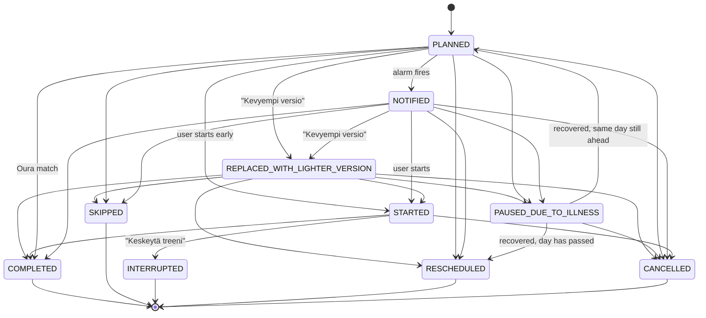

# Training Engine

*(Status: the **state machine is implemented and enforced** by `TrainingRepository` — every
transition is validated and logged. The **rescheduling and illness rules are implemented** in
`TrainingEngine` and covered by `TrainingEngineTest`. **Oura matching is implemented**, in
`MatchOuraWorkoutsUseCase` rather than in the engine — and it deliberately does not change a
session's status; see "Matching imported workouts" below.)*

## Overview
The Training Engine is the core domain logic responsible for modifying the training schedule based on user actions and external factors (missed days, illness). It is a local, deterministic rule engine.

## Session States
A `WorkoutSession` has exactly one of the following states. The enum is
`fi.merilainen.treenivalmentaja.domain.SessionStatus`.

| State | Meaning | Terminal? |
| --- | --- | --- |
| `PLANNED` | Scheduled, alarm not yet fired. Initial state of every imported session. | No |
| `NOTIFIED` | The AlarmManager reminder has fired; the user has been told but has not acted. | No |
| `STARTED` | The user has started the session (or Oura reports an in-progress workout). | No |
| `COMPLETED` | Done — manually confirmed or matched to an Oura workout. | **Yes** |
| `SKIPPED` | Never started, and not moved to another day. | **Yes** |
| `INTERRUPTED` | Started, then ended on purpose before the plan's movements ran out. | **Yes** |
| `RESCHEDULED` | Moved to another day. This row is closed; a **new** session row carries the new date and points back here via `originalSessionId`. | **Yes** |
| `REPLACED_WITH_LIGHTER_VERSION` | The user chose the lighter alternative. The session is still to be done, now with the lighter payload. | No |
| `PAUSED_DUE_TO_ILLNESS` | Illness mode paused this session. It resumes or is rescheduled on recovery. | No |
| `CANCELLED` | Removed from the plan entirely (plan rebuild, plan replaced, user deleted it). Never counted as missed. | **Yes** |

Notes:
- `SKIPPED` and `INTERRUPTED` split what used to be one status. `SKIPPED` is now reachable only
  from a session that has not been started — `STARTED` cannot transition to it. A session ended on
  purpose partway through goes to `INTERRUPTED` instead, which is what lets the AI analysis ("miten
  meni?") be asked about it: `SKIPPED` has nothing recorded to review, `INTERRUPTED` has whatever
  the guided list ticked off before it stopped.
- `REPLACED_WITH_LIGHTER_VERSION` is **not** terminal: it records that the lighter variant was
  substituted, and the session still has to be completed or skipped afterwards. The session row
  also carries the boolean `appliedLighterVariant`, which stays `true` through the later transition
  to `COMPLETED`, so "completed, but lighter" is still visible after the fact.
- `RESCHEDULED` is terminal **for that row**. Moving a session never rewrites its date in place;
  it closes the old row and inserts a new one. The chain is therefore reconstructible.
- The old `LIGHTER` and `MOVED` states are gone. `LIGHTER` → `REPLACED_WITH_LIGHTER_VERSION`,
  `MOVED` → `RESCHEDULED`.

## State Machine

### Allowed transitions (normative)
| From | Allowed to |
| --- | --- |
| `PLANNED` | `NOTIFIED`, `STARTED`, `COMPLETED`, `SKIPPED`, `RESCHEDULED`, `REPLACED_WITH_LIGHTER_VERSION`, `PAUSED_DUE_TO_ILLNESS`, `CANCELLED` |
| `NOTIFIED` | `STARTED`, `COMPLETED`, `SKIPPED`, `RESCHEDULED`, `REPLACED_WITH_LIGHTER_VERSION`, `PAUSED_DUE_TO_ILLNESS`, `CANCELLED` |
| `STARTED` | `COMPLETED`, `INTERRUPTED`, `CANCELLED` |
| `REPLACED_WITH_LIGHTER_VERSION` | `STARTED`, `COMPLETED`, `SKIPPED`, `RESCHEDULED`, `PAUSED_DUE_TO_ILLNESS`, `CANCELLED` |
| `PAUSED_DUE_TO_ILLNESS` | `PLANNED`, `RESCHEDULED`, `CANCELLED` |
| `COMPLETED`, `SKIPPED`, `INTERRUPTED`, `RESCHEDULED`, `CANCELLED` | *(terminal — nothing)* |

An attempted transition outside this table is a programming error. The repository rejects it and
writes nothing — neither the session update nor a `SessionEvent`.

## Event History
Every accepted transition appends one immutable `SessionEvent` row (see
[DATA_MODEL.md](DATA_MODEL.md)) inside the **same transaction** as the session update. Events are
never updated or deleted; the session table is the current state, the event table is the audit
trail. This is what makes "why did this move?" answerable weeks later, and it is the input the
future AI advisor summarises rather than re-deriving from mutated rows.

## Local Deterministic Rules

### Completing a Session
Marks the session as `COMPLETED`. No schedule shifts occur.

### Skipping a Session
Marks as `SKIPPED`. Only offered for a session that has not been started. If it's a critical session, the engine may propose moving it. Otherwise, it is ignored in future load calculations.

### Interrupting a Session
User taps "Keskeytä treeni" on a session that is `STARTED`. Marks as `INTERRUPTED`, carrying
whatever the guided workout had recorded (`GuidedProgress`) at that point — the same field a
session completed early with `COMPLETED` carries. That recorded progress is what lets the AI
analysis describe a partial session honestly instead of assuming it either never happened or ran
to the end.

### Rescheduling (Moving)
The original row transitions to `RESCHEDULED` and a **new** `WorkoutSession` is inserted for the
new date with `originalSessionId` pointing at the original row's id. Both writes and the
`SessionEvent` happen in one transaction. The engine prevents stacking two heavy workouts on the
same day.

### Lighter Alternatives
User selects "Tehdään kevyemmin". The session transitions to `REPLACED_WITH_LIGHTER_VERSION`, the
payload from the plan's `lighterAlternative` block is applied to the row, and
`appliedLighterVariant` is set to `true`. If the plan defines no explicit lighter alternative the
engine falls back to reducing duration/intensity by 30-50%. The session is still open and must
later be completed or skipped.

### Illness Mode
- User triggers "Sick". All future sessions move to `PAUSED_DUE_TO_ILLNESS`.
- **Return-from-illness:** When marked "Recovered", the engine implements a gradual return:
  - Day 1: 20 min very light.
  - Day 2: Rest.
  - Day 3: 50% of normal volume.
  - Resumes normal plan shifted by the total sick days.

### Missed Sessions Handling
- **One missed session:** propose moving it to the next day with no open session.
- **Two or more missed sessions:** propose shifting every open session forward so the first missed
  session lands on today; spacing is preserved.
- Opening or resuming Today computes only a preview. The card states the source/target date or the
  shift and affected count. Room changes only after **Hyväksy siirto**, **Ohita** or **Merkitse
  tehdyiksi** — before writing, each of the three recomputes the proposal under a mutex, so a stale
  or double-accepted proposal cannot move (or close) the calendar twice. This flow requires neither
  Oura nor a recovery reading.
- **Ohita and Merkitse tehdyiksi are the two honest ways to say the training is not still ahead of
  you** — Hyväksy siirto assumes it is. They differ only in whether it happened anyway: Ohita
  closes a session that plainly did not (`SKIPPED`, or `INTERRUPTED` if the session was `STARTED`
  when it went missed — the same split `AiAnalysisAvailability` reasons about), Merkitse tehdyiksi
  one that did, off the books (`COMPLETED`). Both move exactly the missed sessions — the past-dated
  open ones, never a future session — and change no dates. A session paused by illness goes via
  `PLANNED` first for either, which is the transition table's own route out of the pause, and every
  write is its own event: `Merkitty tehdyksi jälkikäteen` for the first, `Ohitettu jälkikäteen
  väliin jääneenä` for the second, both under `EventSource.USER`, so the history says these rows
  were closed by hand rather than recorded as they happened.
- **Neither is remembered separately, because neither needs to be.** Both were once one button,
  "Hylkää", that wrote nothing and was — like the readiness card — remembered only until the next
  plan-zone midnight; a backlog that would never be trained (rows left behind while the app itself
  was being developed) then asked the same question every single day. Ohita replaced that with a
  real status change: a skipped or interrupted session is no longer open, so
  `proposeMissedSessions()` has nothing left to find about it on the next resume — the same
  permanence Merkitse tehdyiksi already had, and for the same reason. Nothing equivalent to the old
  `missed_proposal_dismissed_for` DataStore entry exists any more; there is nothing left to persist
  once the answer is a status the session already carries.

### Matching imported workouts

Implemented in `MatchOuraWorkoutsUseCase`, not in the engine: pairing a recorded workout with a
planned one is a question about two lists, and it changes nothing about the schedule.

- **Same day, nearest in time**, one-to-one, and no further than twelve hours from the session's own
  moment — without that limit a midnight walk attaches itself to a morning session for lack of
  competition.
- **The activity has to fit.** Oura's `activity` is compared to the session's `WorkoutType` with
  case and punctuation stripped, because Oura returns `strengthTraining` where its own prose writes
  `strength_training`. An activity with no mapping — `houseWork` is a real returned value — matches
  nothing and is listed under its own day instead.
- Duration is **not** compared. A 20% margin sounds principled and is not: the plan's `durationMin`
  is what was asked for and Oura's is what happened, and the gap between them is the interesting
  part rather than grounds for rejecting the pair.

**A match does not complete a session.** The earlier version of this document said it set the status
to `COMPLETED`; it does not, and should not. Whether a session counts as done is the user's
statement about their own training, and a ring that noticed some movement is not that statement —
the state machine's whole value is that every transition has an author. What a match does is attach
what Oura recorded to the session, so the card can show what actually happened beneath what was
planned.

### Readiness advice — asking, never acting

Implemented in `ReadinessAdviceUseCase`, and like the matcher it is not part of the engine: it
reads two lists and returns a question. Nothing it produces changes the schedule; accepting the
question's offer calls operations that already existed.

This is the first thing in the app that lets a readiness number *reach* the plan, and the shape of
it is a direct answer to why the previous readiness indicator was deleted. That one showed the same
verdict every day because nothing ever produced a different one — advice with no measurement behind
it. The rule here can only speak when there is a measurement and a session to speak about.

Two rules, checked in order:

1. **A missed session after a poor day.** Yesterday holds a session still open, *and* yesterday's
   readiness is below 70. Offers two things: shifting the programme forward, and starting today
   lighter.
2. **A poor reading today.** Today's readiness is below 70 and today has a session that can still
   be lightened. Offers only lightening — moving a whole programme on one morning's number is a
   bigger claim than one measurement supports.

Rule 1 wins when both would fire; two cards about the same morning would be noise.

What it will not do:

- **A day with no reading produces nothing.** Oura returns a document with no score for a day the
  ring was not worn, and treating that absence as a low score is the "missing is not zero" mistake
  the whole Oura layer exists to avoid.
- **70 is a boundary, not a band.** It is exactly where `DailyRecovery.readinessLabel` stops saying
  "Hyvä", shared deliberately rather than invented a second time.
- **Nothing is offered that cannot be done.** A session already lightened, already completed, or on
  a rest day yields no card rather than a card with a button that would do nothing.
- **Nothing happens automatically.** Both buttons run existing operations — `handleMissedSessions`
  and `applyLighterVersion` — so the plan only ever changes because someone said so, and every
  change lands in the event log with `EventSource.ENGINE` beside it.

Dismissal ("Ei nyt") is held in memory for the current day rather than persisted. A question that
comes back tomorrow morning against a fresh reading is the intended behaviour; a stored flag would
need its own table and its own expiry rules to achieve something worse.

This is deliberately *not* what the missed-session card does, and the difference is the question
each one asks. This card asks about **this morning's measurement**, so a restart that loses the
answer costs one re-ask of a question that was about to expire anyway. The missed-session card asks
about **sessions that will still be missed next week**, and losing that answer meant a stale
backlog re-asking on every install — hence the stored date there and only there.
### Easy-run drift — a fact, with no button under it

Implemented in `EasyRunDriftUseCase`, and it goes one step further than the readiness rule: it is
not part of the engine **and it needs no engine operation at all**, because it proposes no change.
It reads the plan's sessions and what the watch measured for the completed ones, and returns either
a finding or nothing.

*What it detects.* Not one hard easy run — that is a Tuesday, a hill, a headwind. Three in a row is
a finding: base training stops being base training, and the next hard session arrives on tired legs.

*The measure is `icu_intensity`, not `icu_training_load`.* Load grows with duration, so a long calm
run scores high without being hard — it answers "what did this cost". Intensity is a percentage of
threshold and therefore comparable across runs of different lengths; it answers "was this hard",
which is the question.

*The baseline is the athlete's own history, not a fixed band.* "Easy means under 75 % of threshold"
would be invented physiology, which this project has avoided everywhere else. The comparison is
against the median of the athlete's own comparable sessions: self-calibrating, needing no invented
number, and stating a claim the person can check.

**The rule, in one sentence:** the three most recent completed sessions of the same `WorkoutType`
and the same planned `intensity` were each above the median intensity of all comparable stored
sessions.

What it will not do:

- **Fewer than six comparable sessions produces silence** — three to judge plus three of baseline.
  The same discipline as the readiness rule: no measurement, no advice.
- **A session with no matched activity, or one synced before schema v9 and carrying no intensity,
  is excluded rather than counted.** Missing is not zero, and it is not easy either.
- **Equal to the median is not above it.** A flat history raises nothing, which is the correct
  answer for an athlete whose easy runs are all alike.
- **It only speaks on a morning an easy session is still open**, because a session already run
  cannot be run differently. Today's session is the one it can still change; the three it reports
  on are already done.
- **The median includes the three being judged.** They are comparable sessions like any other, and
  this is the conservative direction: three drifting runs pull the median towards themselves and
  make the rule harder to satisfy, never easier.

The card carries every number the claim rests on — the three measurements, the median, and how many
sessions that median was taken over. Its only control is "Selvä", which puts it away for the day
the way the readiness card's "Ei nyt" does; there is no plan-changing button, because lightening a
session that is meant to be light is incoherent.

## Future AI Advisor
- **Role:** Replaces the local deterministic rules for complex, multi-week plan adjustments based on chronic load and Oura readiness scores.
- **Constraint:** The AI **never** modifies the Room database directly.
- **Flow:** AI returns a JSON proposal -> Android parses and displays diff -> User clicks "Approve" -> Room is updated.
