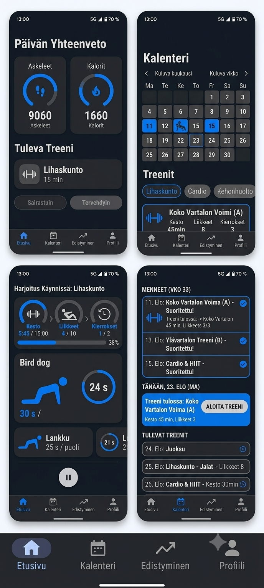
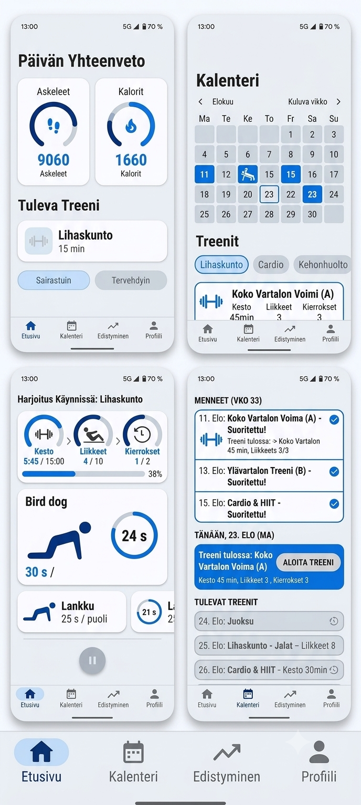

# UI Redesign Specification: Material Design 3 Modernization

Geminin kirjoittama uudistusohje ja sitä vastaavat mockupit, tallennettu 2026-08-23.

Lähtötiedot, joiden pohjalta tämä ohje kirjoitettiin, ovat
[UI_REDESIGN_BRIEF.md](UI_REDESIGN_BRIEF.md):ssä. **Toteutuksen ristiriidat on listattu tämän
sivun lopussa** — ohje ja mockupit ovat kahdesta kohdasta eri mieltä keskenään, ja yksi mockupin
kortti näyttää dataa, jota sovelluksessa ei ole.

## Mockupit

| Tumma | Vaalea |
| --- | --- |
|  |  |

Kummassakin kuvassa neljä näyttöä — Päivän yhteenveto, Kalenteri, Harjoitus käynnissä ja
kalenterin lista — sekä alareunan navigaatiopalkki suurennettuna. PNG-muodossa alkuperäisinä:
kuvat ovat viitemateriaalia dokumentaatiossa eivätkä päädy koskaan APK:hon, joten
`AGENTS.md`:n assettibudjetti ei koske niitä. Kopioitu `cp`:llä, ei tekstityökalun läpi, ja
tarkistettu katsomalla.

---

## 1. Yleiset säännöt & arkkitehtuuri

- Aloita raportti rivillä: `AGENTS.md luettu (v4)`.
- Pidetään `dynamicColor = false` `Theme.kt`:ssa, jotta kustomoitu sähkönsininen (Electric Blue)
  teema pysyy yhtenäisenä Android 12+ -laitteilla eikä Material You korvaa värejä.
- Säilytetään tiukasti jako tilattomiin `XScreenContent(...)`-composableihin ja ohuisiin
  ViewModel-kääreisiin Roborazzi-testattavuuden takaamiseksi.
- Navigointirakenne pidetään kolmessa toimivassa välilehdessä: Tänään, Viikko (tai Kalenteri) ja
  Asetukset. Ei lisätä tyhjiä placeholder-välilehtiä.
- Käyttöliittymätekstit pidetään suomeksi, ilman tavuviivoja.
- Käytetään yksiköinä vain `dp` ja `sp`. Välistykset hoidetaan `Arrangement.spacedBy(...)` ja
  `Modifier.padding(...)` -määreillä.

## 2. Design Tokens & Värimaailma

Päivitetään teematiedostot:

- `ui/theme/Color.kt` (raaka-arvot)
- `ui/theme/Theme.kt` (`lightColorScheme()` ja `darkColorScheme()`)

### Väripaletti (Electric Blue / Inter Milan -henkinen)

| Rooli | Arvo |
| --- | --- |
| Primary | `Color(0xFF007AFF)` (tai syvä `Color(0xFF0A84FF)`) |
| Primary Container (Dark) | `Color(0xFF002B75)` |
| Primary Container (Light) | `Color(0xFFD0E4FF)` |
| On Primary | `Color(0xFFFFFFFF)` |

### Tumma teema (Dark Theme Surfaces)

| Rooli | Arvo |
| --- | --- |
| Background / Surface | `Color(0xFF121212)` |
| Surface Container Low | `Color(0xFF1E1E1E)` |
| Surface Container | `Color(0xFF252525)` |
| Surface Container High | `Color(0xFF2C2C2C)` |
| On Surface (Text Primary) | `Color(0xFFE6E1E5)` |
| On Surface Variant (Text Secondary) | `Color(0xFFCAC4D0)` |

### Vaalea teema (Light Theme Surfaces)

| Rooli | Arvo |
| --- | --- |
| Background / Surface | `Color(0xFFF8F9FA)` |
| Surface Container Low | `Color(0xFFF1F3F4)` |
| Surface Container | `Color(0xFFE8EAED)` |
| Surface Container High | `Color(0xFFDADCE0)` |
| On Surface (Text Primary) | `Color(0xFF1C1B1F)` |
| On Surface Variant (Text Secondary) | `Color(0xFF49454F)` |

> Vältetään kovia korostusvärisiä ääriviivoja korttien ympärillä; syvyys luodaan M3:n Surface
> Container -tasoilla ja hienovaraisilla sävyeroilla.

## 3. Komponentit & Näkymämuutokset

### Päänäkymä (Tänään / Etusivu)

- **Palautuminen & Yhteenveto**
  - Mittarit (Askeleet, Kalorit, Oura-palautumispisteet) pyöreinä `CircularProgressIndicator`- tai
    rengaskomponentteina.
  - Sairastuin- ja Tervehdyin-toimintapainikkeet M3
    `ButtonDefaults.filledTonalButtonColors()`- tai `OutlinedButton`-tyylillä.
- **Tuleva treeni -kortti**
  - 3 selkeää statussaraketta: Kesto (esim. 15 min), Liikkeet (esim. 10) ja Kierrokset (esim. 2).
  - Aloita-painike selkeänä `FilledButton` / Primary-korostuksella.

### Aktiivinen Treeni (Workout in Progress)

- **Yläpalkin mittaristo**
  - Kompakti statustieto: Kesto (5:45 / 15:00), Liikkeet (4 / 10), Kierrokset (1 / 2).
  - `LinearProgressIndicator` treenin kokonaisetenemiselle.
- **Aktiivisen liikkeen Hero-kortti**
  - Liikkeen kuvaus ja toistot/aika (esim. Bird dog — 30 s / puoli).
  - Pyöreä ajastinrengas suoritusajalle.
  - Liikekuvitus ladataan olemassa olevalla Coil-integraatiolla (ExerciseDB/wger).
- **Seuraavat harjoitukset**
  - Kompakti lista tulevista liikkeistä kyseisellä kierroksella.

### Viikko / Kalenteri

- **Menneet ja tulevat treenit**
  - Päivätasolla selkeä jako: Menneet (Vko X) kuittausmerkein (`Icons.Default.CheckCircle`),
    Tänään korostettuna omana korttinaan ja Tulevat treenit neutraalina listana.
- **Kuukausi/viikkoruudukko**
  - M3 `DatePicker`/kalenteriruudukko, jossa suoritetut treenit indikoitu sähkönsinisillä palloilla
    tai kategoriaikoneilla.

## 4. Ikonit & Grafiikka

- Käytetään ensisijaisesti projektissa jo olevaa `material-icons-extended` -kirjastoa (esim.
  lajityypit, navigointi, tilat).
- Jos uusia kategoriaikoneita tarvitaan, ne toteutetaan puhtaina VectorDrawable XML -tiedostoina
  kansioon `res/drawable/` ilman erillisiä bittikarttoja, jotta tinttaus toimii molemmissa
  teemoissa.
- Liikekohtaiset kuvat/animaatiot haetaan jatkossakin suoraan ajonaikaisesti Coililla olemassa
  olevan arkkitehtuurin mukaisesti ([EXERCISE_GUIDE.md](EXERCISE_GUIDE.md)).

## 5. Testaus, Mittaus & Todennus

- Suorita kuvakaappaustestit: `./gradlew :app:recordRoborazziDebug`.
- Tarkista muuttuneet kuvat silmämääräisesti ja palauta muuttumattomat `git checkout` -komennolla
  kohinan välttämiseksi.
- Aja yksikkötestit ja mittaa APK-koko clean-ajon jälkeen.
- Raportoi tulokset muodossa:
  - Testit: `testit/failures/errors`
  - APK-koko tavuina ennen ja jälkeen
  - Päivitetyt tiedostot (`CHANGELOG.md`, `PROJECT_STATUS.md`)

---

## Toteutuspäätökset 2026-08-24

Seuraavat aiemmin avoimet kohdat on lukittu ennen toteutuksen aloittamista:

1. **Navigaatiossa on kolme toimivaa kohdetta:** Tänään, Kalenteri ja Asetukset. Edistymistä ei
   lisätä ennen kuin sillä on oikea näkymä, eikä yhden käyttäjän sovellus tarvitse erillistä
   Profiili-välilehteä.
2. **Yhteenvetorenkaat näyttävät vain jo tallennettua dataa:** Oura-palautumisen, unen ja
   aktiivisuuden pisteet. Askeleita ja päivän kaloreita ei teeskennellä saatavilla oleviksi eikä
   niiden vuoksi lisätä tietokantamuutosta visuaaliseen uudistukseen.
3. **Kalenteriruudukko lasketaan `java.time`:lla.** Mockupin toistuvat ja puuttuvat päivät ovat
   piirrosvirhe, eivät toteutusohje.
4. **`dynamicColor = false`.** Electric Blue -paletti on sovelluksen oma tunnistettava ilme myös
   Android 12+:lla. Muutos kirjataan changelogiin, koska se poistaa Material You -mukautuvuuden.
5. **Statusvärit säilyvät semanttisina väreinä.** Onnistuminen, varoitus, virhe ja neutraali tila
   eivät vaihda merkitystä brändipaletin mukana.

## Ratkaistut ristiriidat (historia)

Nämä eivät ole osa Geminin ohjetta. Ne ovat kohdat, joissa ohje ja mockupit olivat eri mieltä tai
joissa mockup näytti jotain, mitä sovelluksessa ei ollut. Yllä oleva päätöslista kertoo, kumpi
vaihtoehto toteutuksessa voitti.

1. **Kolme välilehteä vai neljä?** Ohjeen kohta 1 sanoo *"navigointirakenne pidetään kolmessa
   toimivassa välilehdessä… ei lisätä tyhjiä placeholder-välilehtiä"*, mutta **molemmissa
   mockupeissa on neljä**: Etusivu, Kalenteri, Edistyminen ja Profiili, ja alareunan palkki on
   suurennettu omaksi kuvakseen juuri neljällä. Toteuttajan on tiedettävä kumpi voittaa. Kolme on
   se, mikä on nykyisin olemassa; neljäs vaatii joko oikean Edistyminen-näytön tai sen
   placeholderin, jota ohje kieltää.
2. **Askeleet ja Kalorit -mittareille ei ole datalähdettä.** Mockupin ensimmäinen kortti näyttää
   "Askeleet 9060" ja "Kalorit 1660" päivätasolla. Roomissa ei ole kumpaakaan: `oura_daily_summaries`
   sisältää palautumis-, uni- ja aktiivisuuspisteet, HRV:n ja leposykkeen, ja kalorit ovat vain
   yksittäisen suorituksen kentässä. Päivän askeleet ja kalorit vaatisivat Ouran
   `daily_activity`-endpointin, uuden sarakkeen ja migraation — se on datapiirre, ei visuaalinen
   uudistus, ja kuuluu omaan muutokseensa. Vaihtoehtoisesti nämä kaksi renkaan korvataan sillä,
   mitä on: palautumispisteet, unipisteet, harjoituskuorma.
3. **Kalenterin ruudukko mockupissa ei mene kuukausikalenterina umpeen** (tummassa rivi
   "18 19 22 23 24 25 26" ja toistuva 25–26; vaaleassa 23 esiintyy kahdesti). Se on mockupin
   piirtovirhe eikä spesifikaatio — oikea ruudukko rakennetaan `java.time`-viikkopäivistä, kuten
   nykyinen viikkonäkymä tekee.
4. **`dynamicColor = false` on käyttäytymismuutos, ei pelkkä väriarvo.** Se poistaa Material
   You -mukautuvuuden kaikilta Android 12+ -laitteilta. Ohje perustelee sen (paletin
   yhtenäisyys mockuppien kanssa), mutta se kannattaa kirjata `CHANGELOG.md`:hen näkyvänä
   muutoksena eikä hukata teematiedoston diffiin.
5. **Nykyiset teemavärit katoavat.** `Color.kt`:n `BluePrimary`, `SurfaceLight/Dark` ja
   tekstivärit korvautuvat kokonaan. Status-värit (`ColorGreen`, `ColorYellow`, `ColorRed`,
   `ColorGray`) ovat eri asia: ne koodaavat harjoituksen tilaa eivätkä ole brändiväriä, joten
   niiden kohtalo on päätettävä erikseen eikä niitä pidä pyyhkiä paletin mukana.

---

## Toteutuksen tila 2026-08-24

Ohje on toteutettu. Mitä missäkin:

| Ohjeen kohta | Tila |
| --- | --- |
| §1 `dynamicColor = false`, kolme välilehteä, tilattomat `XScreenContent` | Tehty |
| §2 Design tokenit | Tehty. `Color.kt` vastaa taulukoiden heksa-arvoja |
| §3 Palautumisrenkaat | Tehty `MetricRing`illä — palautuminen, uni, aktiivisuus |
| §3 Tulevan treenin kolme statussaraketta | Tehty `WorkoutStatColumns`illa, **vain voimaharjoituksille** |
| §3 Aktiivinen treeni | Tehty: `WorkoutProgressHeader`, hero-kortti, ajastinrengas, "Seuraavaksi" |
| §3 Viikko/kalenteri, mennyt–tänään–tuleva | Tehty `WeekDayHeader`illä |
| §3 Kuukausiruudukko | Tehty `MonthCalendar`illa `java.time`sta |
| §4 Ikonit | Käytössä `material-icons-extended`; uusia VectorDrawableja ei tarvittu |

**Kaksi asiaa, joita ohjeesta ei toteutettu, ja miksi.** Kumpikin on päätöslistalla ylempänä, mutta
ne on syytä lukea myös täältä, koska mockup näyttää molemmat:

1. **Askeleet ja Kalorit -renkaat.** Ei datalähdettä. Vaativat Ouran `daily_activity`-endpointin,
   uuden sarakkeen ja migraation — datapiirre, ei visuaalinen uudistus.
2. **Neljäs välilehti "Edistyminen".** Vaatisi oikean näytön; placeholder on ohjeessa kielletty.

**Yksi lisäys, jota ohjeessa ei ollut.** Kalenterin päivää täppäämällä alla oleva lista siirtyy
siihen päivään. Ruudukko oli siihen asti pelkkä kuva: se näytti missä harjoitukset ovat mutta
niihin ei päässyt siitä käsin.

**Yksi ohjeen aukko, joka löytyi vasta toteutuksessa.** §2:n taulukot eivät nimeä
`secondaryContainer`-, `onSecondaryContainer`-, `errorContainer`- eikä `onErrorContainer`-rooleja.
Material 3 täyttää määrittelemättömän roolin omasta perusparetistaan, joten ensimmäinen tonaalinen
painike piirtyi liilana. Roolit lisättiin `GreenAccent`in ja `RedAccent`in väriperheistä. Sama
koskee mitä tahansa tulevaa komponenttia, joka tavoittelee roolia jota tämä skeema ei määrittele.
